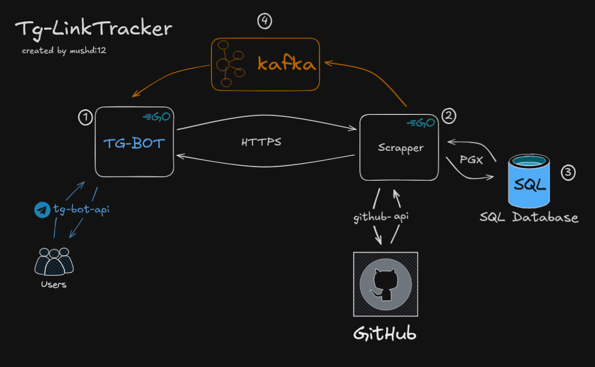

# Tg-LinkTracker

**Tg-LinkTracker** — это Telegram-бот и серверный скраппер, предназначенные для отслеживания и анализа ссылок GitHub в Telegram. Проект реализован на языке Go и использует Docker для контейнеризации компонентов.

### Архитектура приложения:

Как можно было заметить архитектура микро-сервисная. Пройдемся по каждому микро-сервису.

## 1) Tg-bot
#### Команды бота
- `help` - вывести список доступных команд.
- `start` - Зарегистрироваться.
- `track` - Начать отслеживание ссылки. Потом нужно ввести ссылку и фильтр.
- `untrack` - Прекратить отслеживание ссылки. Потом нужно ввести ссылку.
- `list` - Вывести список отслеживаемых ссылок.

- этот микро-сервис отвечает за принятие ссылок из 